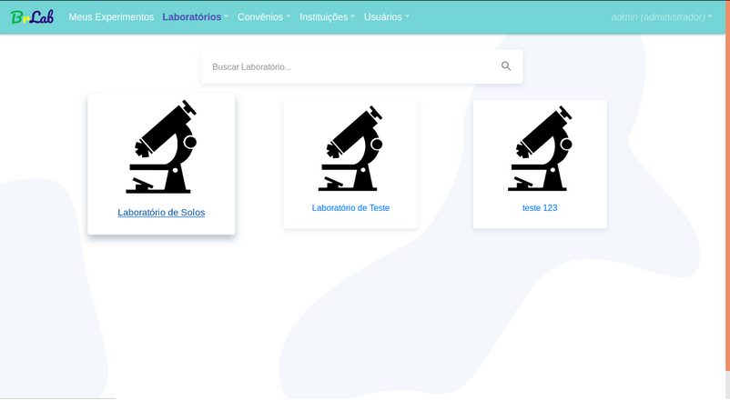
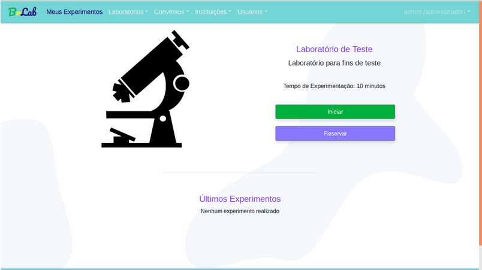
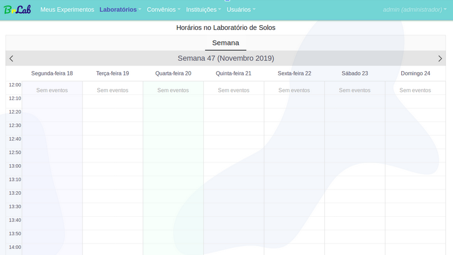

 [Objective](#objective) • 
 [Technologies](#technologies) • 
 [Installation](#installation) • 
 [Screenshots](#screenshots) • 
 [API consumption](#api-consumption)

<div id="objective">
<h2> ⛳ - Project's objective</h2>
<p align='justify' >
This project consists of a system that centralizes access to information about remote laboratories using the Online Laboratory Sharing Network Architecture (ARCL) proposed by Lima (2013) at the IFNMG Campus Januária.
</p>
</div>

<h2 id="technologies">🛠 - Technologies</h2>
<ul>
<li>Vue.js</li>
<li>BootstrapVue</li>
</ul>

<h2 id="installation">⬇ -  Install the dependencies necessaries</h2>

### Installation with yarn 
```bash
$ yarn install
```

<b>Execute the project</b>
```bash
$ yarn run serve
```

### Installation with npm

```bash
$ npm install
```

**Execute the project**
```bash
$ npm run serve
```

### Link to acess system
<https://brlab.herokuapp.com/>

<h2 id="screenshots">🎥 - Screenshots</h2>

All laboratories availables in the system show here.


Each laboratory allows the scheduling to experimentation or start of experimentation but just with previous scheduling


Each laboratory allows the scheduling respecting the your maximum time limit



<h2 id="api-consumption">🔄 API Consumption</h2>

The api has developed in python and your source code is in repository <https://github.com/victorroli/api_v1>.

Check API's documentation and endpoints availables in: <https://documenter.getpostman.com/view/5404533/TVRq1RHu>.

<div style="display: flex;">


</div>
